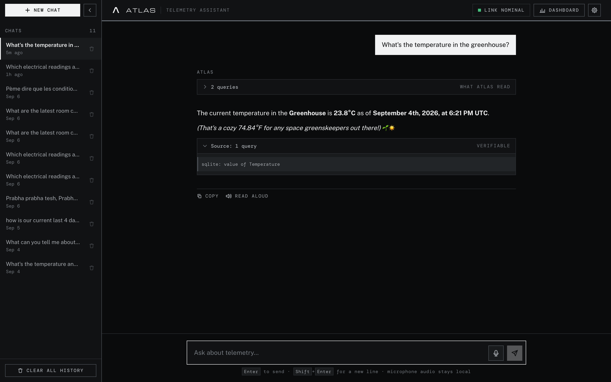
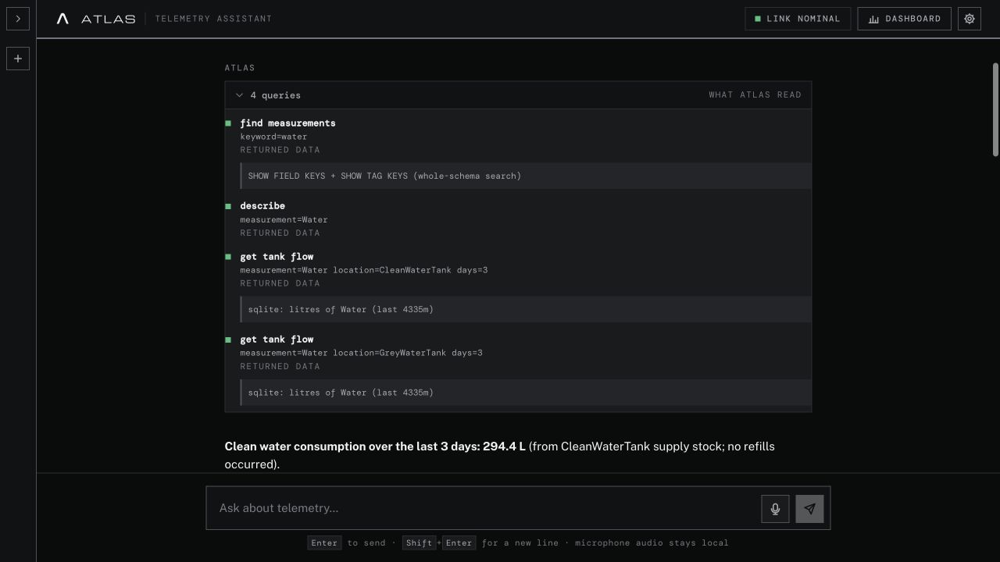
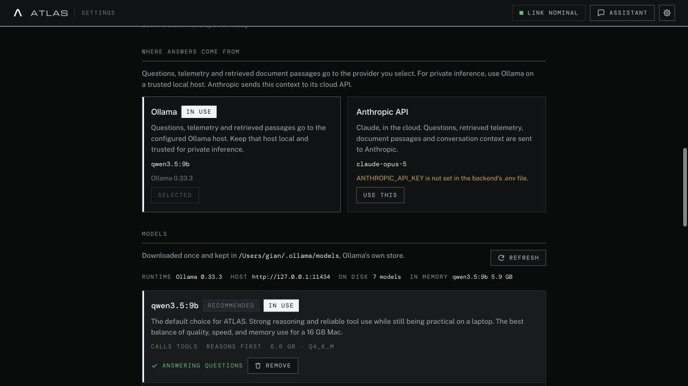
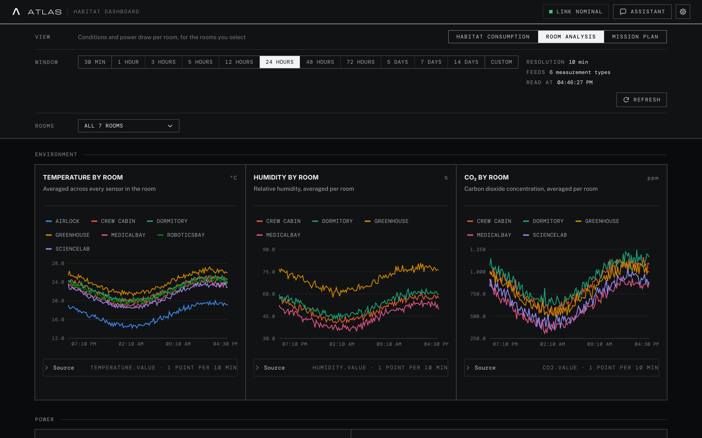
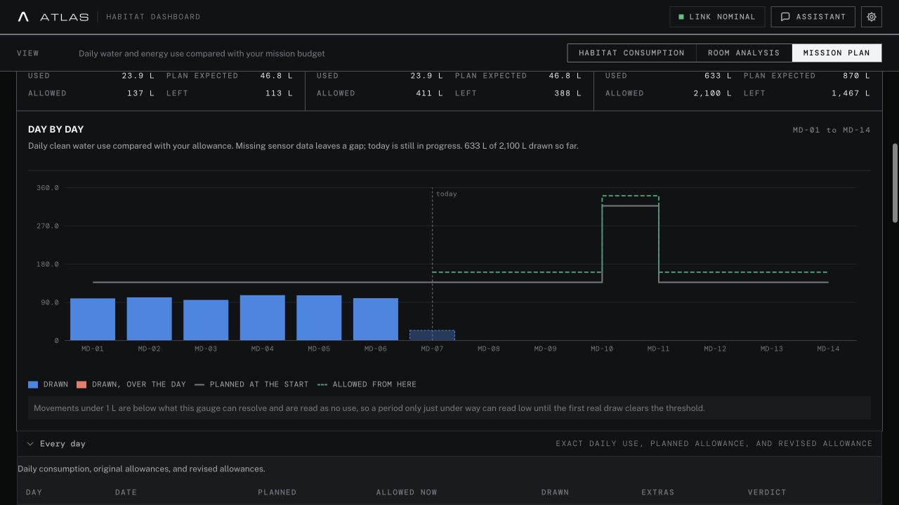
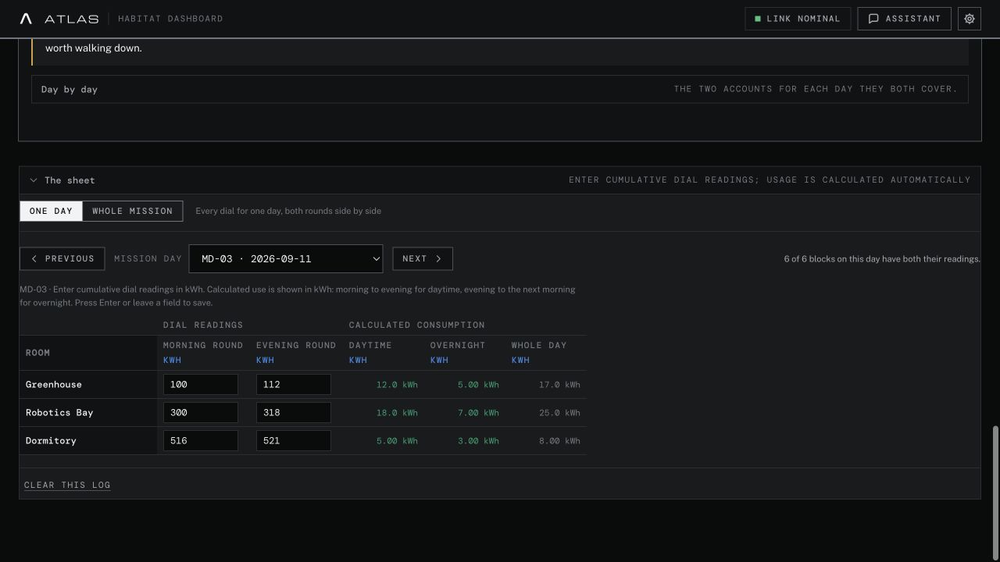

# ATLAS

**Talk to your habitat. Track your mission.**

ATLAS is a local-first AI assistant and telemetry dashboard for analog space
missions. Crew members can ask questions about their habitat in plain language,
explore the readings behind an answer, and track water and energy against their
mission plan.

> “How much water did we use?” → “How does that compare with our plan?” →
> “Which readings support that conclusion?”



Built and maintained by [GianScala](https://github.com/GianScala).
React + TypeScript frontend · FastAPI backend · local inference through Ollama ·
optional Anthropic cloud provider.

## The problems we solve

Habitat data is useful only if the crew can turn it into an answer in time.
ATLAS brings together the measurements, the mission's targets, and the questions
people need to ask during a shift.

| Crew problem | What ATLAS provides |
| --- | --- |
| Answering a question requires knowing the database schema or writing a query | A conversational assistant that selects tools to read the habitat's data |
| A chart shows a change, but the crew needs a comparison or explanation | Follow-up questions about time periods, rooms, consumption, and the mission plan |
| A fluent AI answer is difficult to check | Visible tool activity and source references behind telemetry answers |
| Consumption figures are disconnected from mission targets | Daily use compared with allowances for today, the current cycle, and the mission |
| Handwritten sub-meter readings are hard to interpret | Manual readings converted into daytime/overnight use and shares by room or tap |
| Cloud access is unavailable or unsuitable for habitat context | Local inference on a habitat computer using installed Ollama models |

## Two ways to work with your habitat

**The dashboard gives you a regular view of the mission. The assistant lets you
investigate a question.** They use the same backend tools and calculations, but
serve different parts of the crew's workflow.

| | Track and monitor | Ask and investigate |
| --- | --- | --- |
| Start with | A chart, a date range, or a mission day | A question in your own words |
| Useful for | Daily checks, budget reviews, and recording meter rounds | Comparisons, explanations, and follow-up analysis |
| Result | Charts, tables, allowances, and coverage indicators | A streamed answer with tool activity and available sources |
| Needs an AI model? | No | Yes: local Ollama or the optional cloud provider |

### 1. Talk to the habitat

Ask ATLAS about current conditions, resource use, or the crew's saved plan. It
can look up readings, request summaries, and explain the returned results in a
form the crew can use: a short answer, a daily table, or a more detailed comparison.
You can continue in the same conversation to narrow the question or ask for the
evidence behind a conclusion.

| Example question | What it helps you understand |
| --- | --- |
| “What are the latest conditions in the greenhouse?” | The available room readings, their units, and timestamps |
| “How much clean water did we use over the last three days?” | Consumption by period, distinguished from tank refills |
| “How does our water use compare with the mission plan?” | Recorded spending, the crew's targets, and the allowance ahead |
| “From our manual log, which room used the most energy?” | Consumption derived from crew readings, with its coverage limits |
| “Break that down by day and tell me which readings are missing.” | A more specific follow-up without starting the conversation over |

These are questions to try, not prewritten reports. What ATLAS can answer
depends on the connected sensors, saved plan, manual readings, and selected
model. It can describe patterns supported by those records; a pattern alone
does not establish a physical cause such as a leak or equipment fault.

#### From question to evidence

```text
Crew question → local model chooses a tool → ATLAS reads the data
              ← model explains the result ← calculations and source references
```

1. **Understand the question.** The model receives the conversation and the
   habitat context: available measurements, names, units, and saved plan details.
2. **Retrieve the relevant records.** It requests tools for readings, history,
   consumption, mission tracking, or the crew meter log. ATLAS validates and
   executes those requests; the model does not write arbitrary database queries.
3. **Explain the result.** The model uses the returned figures to answer and may
   request more information before finishing. Consumption arithmetic is handled
   in backend code.
4. **Let the crew inspect it.** Expand **what ATLAS read** for the tool calls and
   their outcomes, and **Source** for the references returned by those tools.



The trace shows what was requested and whether it returned data. The Source
panel shows the query text or query summary returned by the adapter. The SQLite
demo uses descriptive summaries, not executable SQL; use the trace to inspect
the requested sensor and filters. Manual meter logs and attached documents
have their own provenance. Source visibility makes an answer reviewable, but does not guarantee
that the model interpreted it correctly.

#### Run the AI inside the habitat

**Ollama runs the model on the configured computer.** In the default local setup,
the question, conversation history, and retrieved habitat context are processed
on that machine rather than sent to a cloud model. There is no cloud API key
required for local chat.

Once the runtime and model files are installed, local chat can work without
internet access, provided the habitat database and any other required local
services remain reachable. Downloading models needs connectivity; inference
uses the installed files. If you configure a remote Ollama host, that host
receives the context instead.

In **Settings → AI & models**, you can see the active provider, browse installed
models, download models, and choose which one answers. Pick a model with **tool
support**: ATLAS needs it to request real readings. Model size, available memory,
and context length affect response time and the questions it can handle well.



The water-query trace and the model-selection screenshot use **Qwen 3.5 9B**;
every screenshot here runs through local Ollama against the synthetic demo
habitat. Responses vary between runs and models.
The same assistant workflow also supports Anthropic when a crew chooses cloud
inference; that sends questions and retrieved context to Anthropic.

Optional local voice tools let crew members dictate a question and listen to
the answer. Attached procedures and reference documents can also be searched
when configured under **Settings → Connectors**. See the
[AI assistant guide](docs/assistant-guide.md) for setup, follow-ups, and reading sources.

### 2. Track consumption and the mission plan

The dashboard works independently of the AI. Use it for a quick status check,
an exact daily figure, or a regular meter-entry routine.

| View | What it shows |
| --- | --- |
| Habitat consumption | Whole-habitat water use, tank levels, power draw, and energy consumption |
| Room analysis | Temperature, humidity, CO₂, and available power readings for selected rooms |
| Mission plan | Telemetry compared with the crew's saved water and energy budgets |
| Crew meter log | Consumption calculated from manual cumulative dial readings |



In **Dashboard → Mission plan**, enter the start date, duration, and total
resource budgets. ATLAS calculates daily allowances and revises the allowance
for the days ahead as recorded consumption comes in. Planned extras reserve
budget for activities such as experiments or cleaning.



Expand **Every day** for exact values. Missing telemetry remains a gap;
today's use is still in progress. The mission's day boundary can differ from
a rolling dashboard window, so compare matching periods when checking a chat
answer against a chart.

For manual readings, open **Habitat consumption → Crew meter log → The sheet**.
Enter the cumulative value on each dial. For example, **100 → 112 → 117 kWh**
across morning, evening, and the next morning produces **12 kWh daytime**,
**5 kWh overnight**, and **17 kWh for the day**.



The assistant can query the manual log too, but these records stay separate
from telemetry: they do not fill sensor gaps or change Mission plan's measured
consumption. See the [consumption guide](docs/consumption-guide.md) for daily
tables, room/tap breakdowns, missing rounds, and the comparison with habitat meters.

## Quick start

You need Python 3.11+ and Node.js 22.12+. Run these commands from the repository
root in two terminals.

**1. Start the backend with synthetic telemetry**

```bash
cd atlas_backend
python3 -m venv .venv
.venv/bin/pip install -r requirements.txt
cp .env.example .env
.venv/bin/python scripts/seed_demo_sqlite.py
.venv/bin/python -m uvicorn app.main:app --reload
```

**2. Start the frontend**

```bash
cd atlas_frontend
npm install
npm run dev
```

Open [localhost:5173](http://localhost:5173). The charts work without a language
model. For chat, start [Ollama](https://ollama.com/download), then install and
select a model in **Settings → AI & models**.

The demo contains 30 days of synthetic sensor readings. Mission plans and manual
readings start empty; follow the [consumption guide](docs/consumption-guide.md)
to add them. The seeder preserves an existing database; use `--force` only to
replace that synthetic telemetry with a fresh rolling window.

## Connect your habitat

ATLAS reads through a data-source adapter. A YAML habitat profile supplies room
names, units, tanks, mission resources, and crew meters.

### Supported data-source adapters

| Adapter | `DATA_SOURCE` | Configuration |
| --- | --- | --- |
| SQLite (default) | `sqlite` | `SQLITE_PATH` to an ATLAS readings database |
| PostgreSQL / MySQL / TimescaleDB | `sql` | `SQL_DSN`, a driver, and `sql_mapping` in the profile |
| InfluxDB 1.x | `influxdb` | `INFLUX_URL`, `INFLUX_DB`, and credentials |
| InfluxDB through Grafana | `grafana` | `GRAFANA_URL`, credentials, and `GRAFANA_DATASOURCE_UID` |

Copy a [profile example](atlas_backend/config/examples) into
`atlas_backend/config/private/`, then set `HABITAT_CONFIG` and the adapter's
connection settings in `.env`. Use read-only database credentials.
See [configuration](docs/configuration.md) for details.

## Development

```text
atlas_backend/app/
  datasource/   Database adapters and the structured Query interface
  telemetry/    Sensor queries and consumption calculations
  mission/      Plans, daily tracking, and manual meter logs
  tools/        Tools available to the assistant
  services/     Agent loop, dashboard, settings, and supporting services
  api/          FastAPI routes
atlas_frontend/src/
  pages/        Chat, dashboard, mission, meter log, and settings
  hooks/        Fetching, caching, and streamed chat state
  lib/          API contracts, formatting, and chart helpers
  components/   Shared controls and charts
```

Read the [backend README](atlas_backend/README.md) or
[frontend README](atlas_frontend/README.md) for commands and implementation notes.

### Writing a new data-source adapter

Implement [DataSource](atlas_backend/app/datasource/base.py), render the
structured [Query](atlas_backend/app/datasource/query.py) for your database,
and register the adapter in `app/datasource/__init__.py`. Use the SQLite adapter
as an example. Keep database-specific code inside `datasource/` and add tests
for discovery, filtering, time grouping, and aggregation.

For a new tool, add the telemetry function and register it under `app/tools/`.
For a chart, update the dashboard catalogue or habitat profile. See
[CONTRIBUTING.md](CONTRIBUTING.md) for checks and contribution guidelines.

## Deployment and limits

ATLAS is a shared application for a trusted crew. Remote deployments need
authentication in front of the whole site; follow the
[deployment guide](docs/deployment.md). Keep private mission data and credentials
out of this repository.

The assistant is instructed to cite sources and avoid unsupported figures, but
model answers can still be wrong. Check the readings behind operational decisions.
Cloud inference sends questions and retrieved context to the selected provider.
See [security and privacy](SECURITY.md) and [release status](docs/release-readiness.md).

## Documentation

- [AI assistant guide](docs/assistant-guide.md) — local models, conversations, tools, and sources
- [Consumption guide](docs/consumption-guide.md) — plans, daily totals, and manual readings
- [Configuration](docs/configuration.md) — telemetry, profiles, models, and environment variables
- [Backend](atlas_backend/README.md) · [Frontend](atlas_frontend/README.md) — developer setup and architecture
- [Screenshot setup](docs/screenshots.md) — reproduce the synthetic examples

## License

[Apache License 2.0](LICENSE). See [NOTICE](NOTICE) and
[third-party notices](THIRD_PARTY_NOTICES.md) for attribution.
