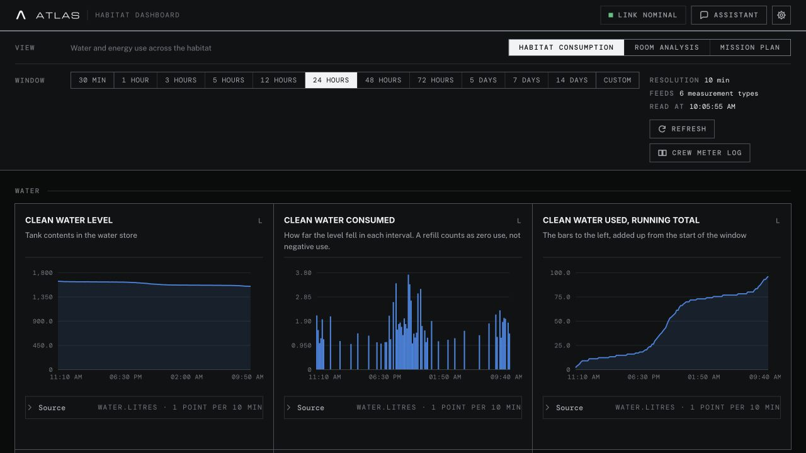
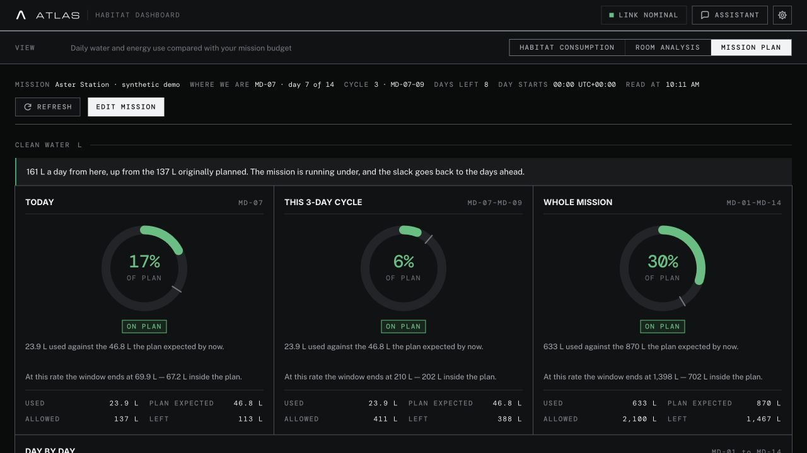
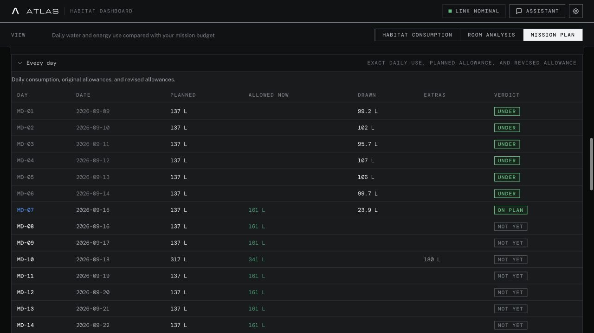
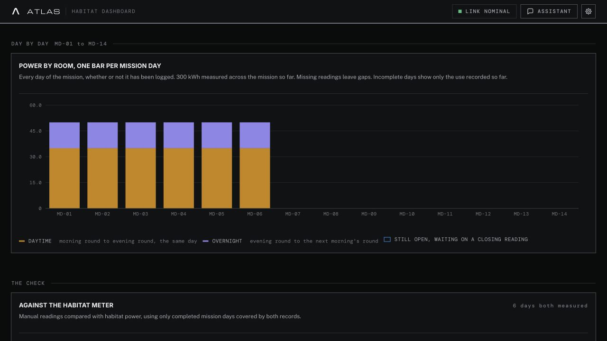
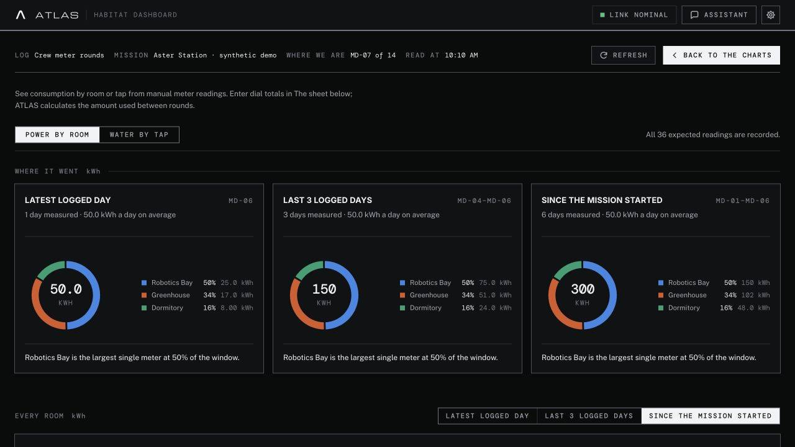
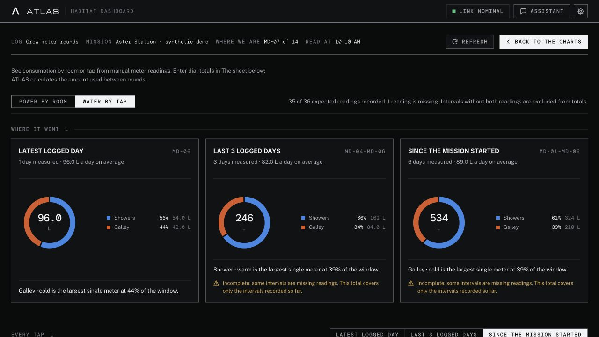

# Track daily consumption

Use **Mission plan** to compare sensor-recorded use with your budget. Use
**Crew meter log** to understand consumption by room or tap from readings taken
by hand. The two views use separate records and help answer different questions.

## 1. Check the telemetry

Open **Dashboard → Habitat consumption** and choose a time range. The water
panels show tank level, consumption per interval, and cumulative use within the
selected window. Power panels separate instantaneous power draw (W) from energy
used (kWh). Open **Source** to inspect the query behind a panel.

A rolling **24 hours** window is not the same as a mission calendar day. For
use since the mission's day boundary, open Mission plan. Its **Day starts**
readout shows the fixed UTC offset used for daily totals.

## 2. Set the mission budget

Open **Mission plan**, then add or edit the mission:

1. Enter a name, start date, and duration in whole days.
2. Enter the **total budget for the whole mission**, in the displayed units.
3. Save the plan. MD-01 is the first mission day.
4. Add an **extra** for a planned activity, either on one day or every day.

An extra reserves part of the existing budget. It does not increase the total.
For example, a 14-day water budget of 2,100 L with a 180 L experiment on MD-10
leaves about **137 L per ordinary day**, with about **317 L on MD-10**.

Suggested budgets are starting values, not mission requirements. Replace them
with your crew's plan. A blank resource budget means that resource is uncapped.

## 3. Read today's position and the days ahead

Each resource has cards for **Today**, **This 3-day cycle**, and **Whole mission**.

| Figure | Meaning |
| --- | --- |
| Used | Consumption recorded by telemetry in that period |
| Plan expected | What the saved plan expected to have been used by now |
| Allowed | The original allowance for the full period |
| Left | That period's allowance minus recorded use |
| Daily allowance from here | The revised allowance after accounting for recorded spending and future extras |

The ring shows the share of the allowance used. Its marker shows what was
expected by now. Read the status and those two figures together: today's
percentage alone does not tell you whether consumption is on pace.

The **Day by day** chart shows:

- **Drawn:** consumption measured for each day; an over-budget day has a separate colour.
- **Planned at the start:** the original daily allowance, including extras.
- **Allowed from here:** the revised allowance for today and future days.
- **Today:** an unfinished day, marked separately from completed days.

Expand **Every day** to read exact values. **Planned** is the original allowance;
**Allowed now** is the revised allowance; **Drawn** is measured use. Past days
have no revised allowance. Future days have no measured use yet.

Missing telemetry is not zero consumption. If coverage is incomplete, recorded
use is a lower bound and the remaining budget may be optimistic. Check warnings,
sources, and reading times before treating a total as complete. Tank measurements
also have noise thresholds and a short confirmation delay.

## 4. Enter manual dial readings

Return to **Habitat consumption → Crew meter log**. Choose **Power** or **Water**,
expand **The sheet**, and select **One day** or **Whole mission**.

Enter the cumulative number displayed on the meter. Save with **Enter** or by
leaving the field. The analysis updates after the reading is saved.

| Reading | Greenhouse example |
| --- | --- |
| MD-03 morning | 100 kWh |
| MD-03 evening | 112 kWh |
| MD-04 morning | 117 kWh |

ATLAS calculates **12 kWh daytime**, **5 kWh overnight**, and **17 kWh for MD-03**.
Enter 100, 112, and 117 in the reading fields; the calculated columns show the
usage automatically.

Power readings use **kWh**. Water dials are entered in **m³** and consumption is
shown in **L**: a change from 10.000 to 10.024 m³ is 24 L. Always check the units
printed above the entry fields.

An overnight interval closes with the next morning's reading. The full-day cell
stays blank until both intervals can be calculated. The final mission night's
interval remains open when there is no following morning in the sheet.

To add or rename dials, open **Settings → Database nomenclature → Crew meter log**.

## 5. Check where consumption went

The log shows totals and shares for the **Latest logged day**, **Last 3 logged
days**, and **Since the mission started**. Check the mission-day labels on each
card: the latest logged day can be earlier than today.
Use **By room** or **By tap** to find the largest recorded users, and **Day by day**
to compare dates. Water also separates warm and cold use.

Coverage matters: a missing morning or evening reading leaves an interval
unmeasured. A lower reading than the previous one is flagged for review.
Partial totals describe only the recorded intervals, and incomplete bars are
not evidence of low consumption.

**The check** compares manual totals with habitat telemetry when the data and
units permit. Differences can come from missing rounds, different measurement
boundaries, shared equipment, unmetered taps, or entry errors. The comparison
helps you investigate; it does not automatically establish which reading is wrong.

Manual entries do not fill telemetry gaps or change Mission plan's measured
consumption. Planned extras are also separate: they reserve budget, but do not
record actual use.

## A useful daily routine

1. Record the morning and evening dial readings.
2. Check yesterday's manual totals after today's morning round closes them.
3. Review **Mission plan → Every day** for yesterday's use against its allowance.
4. Review the revised daily allowance and upcoming extras.
5. Investigate missing coverage or differences in **Crew meter log → The check**.

You can also ask the assistant to compare consumption with your mission plan.
Inspect its sources and the period it used before comparing its answer with a chart.

All screenshots use synthetic data. See [screenshot setup](screenshots.md) to
reproduce the populated mission and manual log without touching existing data.
MD-07 is the capture day, so dates and telemetry totals change when regenerated.
